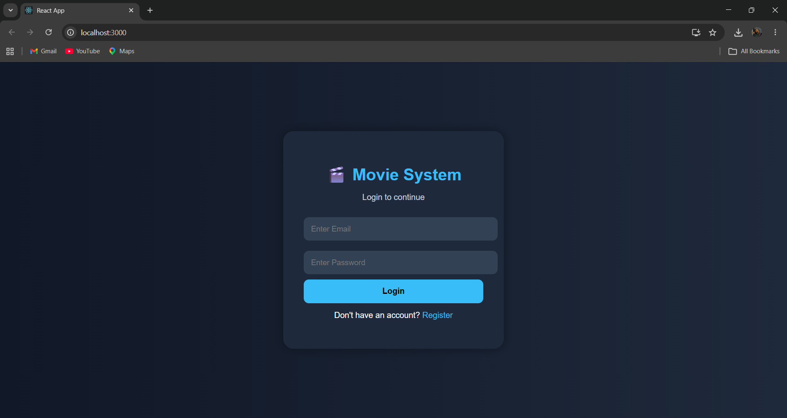
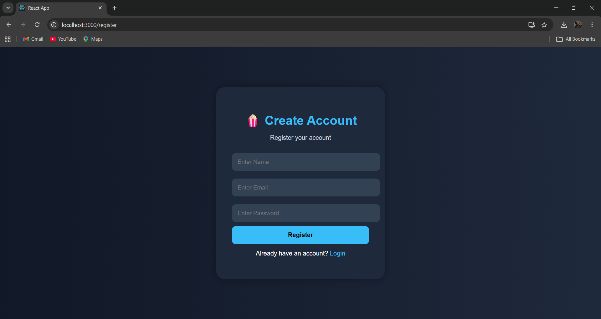
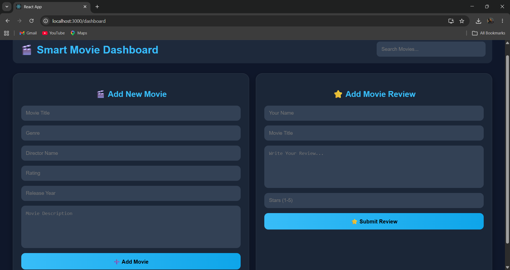
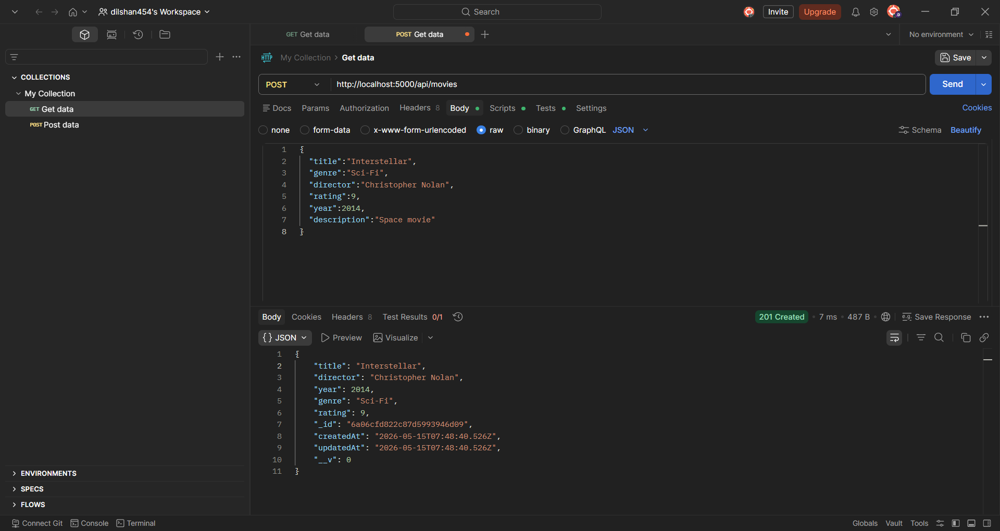
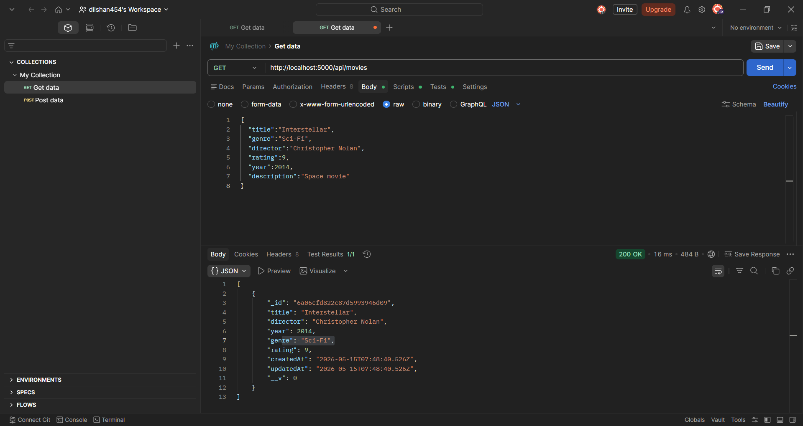
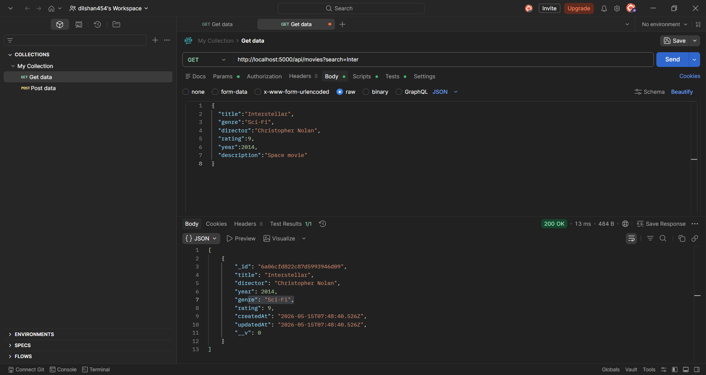
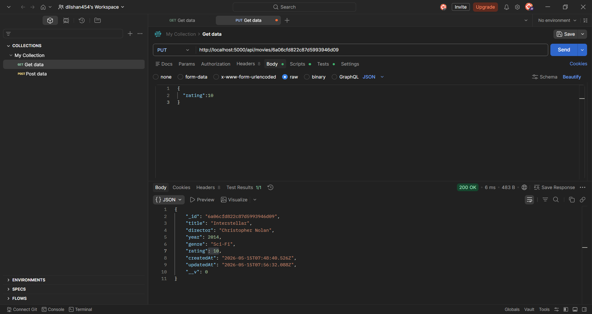
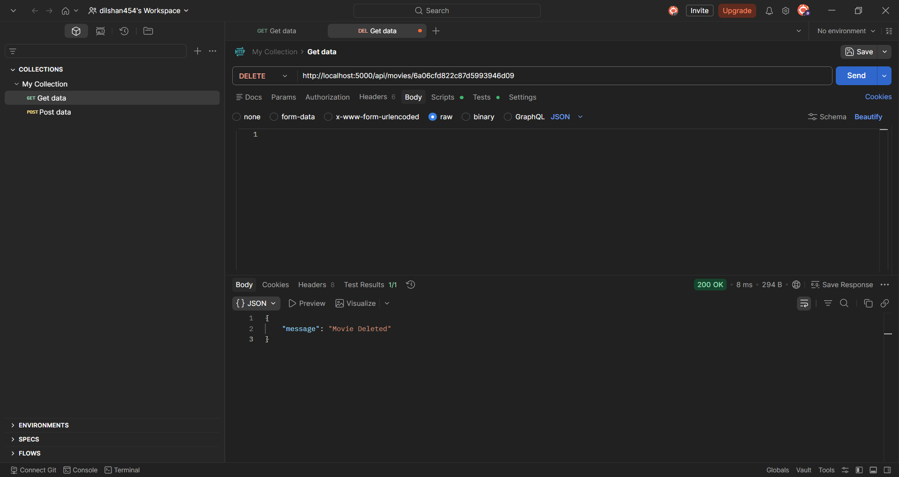
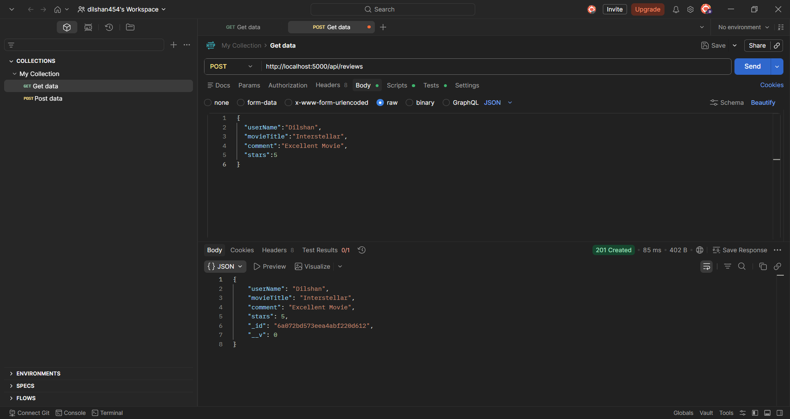
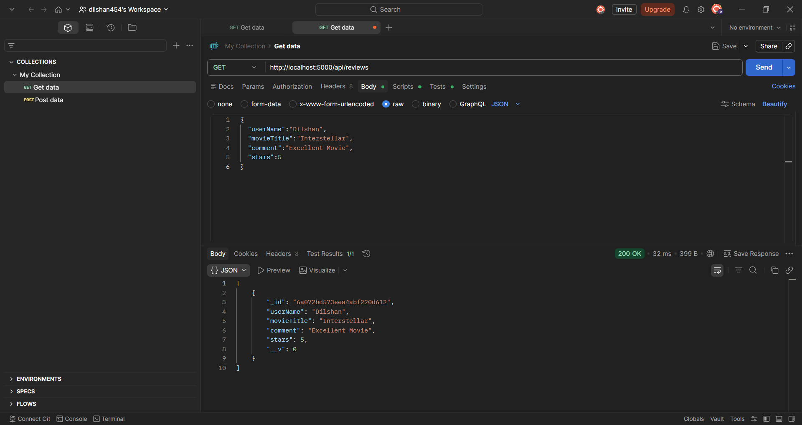

# 🎬 Smart Movie Recommendation System

A full-stack web application built with **Node.js**, **Express.js**, **MongoDB**, and **React.js** for managing movie information and user reviews.


---

## 📌 Problem Statement

Users spend significant time searching for movies and reading reviews across multiple websites. This project solves that by providing a **centralized platform** for movie management and reviews — all in one place.

---

## 💡 Solution

A full-stack movie management system with:

- ✅ User Registration & Login
- ✅ Movie CRUD Operations
- ✅ Movie Search
- ✅ User Review & Rating System
- ✅ Modern React Frontend
- ✅ RESTful API Backend

---

## 🚀 Features

### 🔐 Authentication
- User Registration
- User Login

### 🎬 Movie Management
- Add / View / Update / Delete Movies
- Search Movies by title

### ⭐ Review System
- Submit Reviews & Ratings
- View All Reviews

### 🌐 Frontend
- React Dashboard
- Responsive UI
- Interactive Movie Cards
- Search Functionality

### 🔗 Backend
- RESTful API (Express.js)
- MongoDB Integration
- Input Validation & Error Handling

---

## 🛠 Tech Stack

| Layer | Technology |
|-------|-----------|
| Frontend | React.js, Axios, CSS3 |
| Backend | Node.js, Express.js |
| Database | MongoDB Atlas, Mongoose |
| API Testing | Postman |
| Version Control | GitHub |

---

## 📂 Project Structure

```
Movie_Database_API/
│
├── frontend/
│   ├── src/
│   ├── public/
│   └── package.json
│
├── controllers/
├── models/
├── routes/
├── screenshots/
├── .env
├── server.js
└── package.json
```

---

## ⚙️ Installation & Setup

### 1️⃣ Clone the Repository

```bash
git clone https://github.com/Dilshan454/Movie_Database_API.git
cd Movie_Database_API
```

### 2️⃣ Install Backend Dependencies

```bash
npm install
```

### 3️⃣ Configure Environment Variables

Create a `.env` file in the root directory:

```env
PORT=5000
MONGO_URL=mongodb://127.0.0.1:27017/movieDB
```

### 4️⃣ Run Backend Server

```bash
npm run dev
```

> Backend runs on: `http://localhost:5000`

### 5️⃣ Install Frontend Dependencies

```bash
cd frontend
npm install
```

### 6️⃣ Start Frontend

```bash
npm start
```

> Frontend runs on: `http://localhost:3000`

---

## 🔥 API Endpoints

### 🔐 Authentication

| Method | Endpoint | Description |
|--------|----------|-------------|
| POST | `/api/auth/register` | Register a new user |
| POST | `/api/auth/login` | Login user |

**Register Request Body:**
```json
{
  "name": "Dilshan",
  "email": "dilshan@gmail.com",
  "password": "123456"
}
```

**Login Request Body:**
```json
{
  "email": "dilshan@gmail.com",
  "password": "123456"
}
```

---

### 🎬 Movies

| Method | Endpoint | Description |
|--------|----------|-------------|
| GET | `/api/movies` | Get all movies |
| POST | `/api/movies` | Add a new movie |
| GET | `/api/movies?search=Inter` | Search movies |
| PUT | `/api/movies/:id` | Update a movie |
| DELETE | `/api/movies/:id` | Delete a movie |

**Add Movie Request Body:**
```json
{
  "title": "Interstellar",
  "genre": "Sci-Fi",
  "director": "Christopher Nolan",
  "rating": 9,
  "year": 2014,
  "description": "Space movie"
}
```

---

### ⭐ Reviews

| Method | Endpoint | Description |
|--------|----------|-------------|
| POST | `/api/reviews` | Add a review |
| GET | `/api/reviews` | Get all reviews |

**Add Review Request Body:**
```json
{
  "userName": "Dilshan",
  "movieTitle": "Interstellar",
  "comment": "Excellent Movie",
  "stars": 5
}
```

---

## 📸 Screenshots

### 🔐 Login Page


---

### 🔐 Register Page


---

### 🎬 Dashboard


---


### 🧪 Postman API Testing

#### ➕ Add Movie (POST)


---

#### 📋 Get All Movies (GET)


---

#### 🔍 Search Movie (GET)


---

#### ✏️ Update Movie (PUT)


---

#### 🗑️ Delete Movie (DELETE)


---

#### ⭐ Add Review (POST)


---

#### 📋 Get Reviews (GET)


---


## 🌟 Future Improvements

- [ ] JWT Authentication
- [ ] Password Encryption (bcrypt)
- [ ] Movie Recommendation AI
- [ ] User Profiles & Watchlist
- [ ] Admin Dashboard
- [ ] Movie Image Upload
- [ ] Favorite Movie System

---

## 🎓 Academic Purpose

This project was developed as an individual academic assignment for:

**Module:** Web Services and Technology (IT2234)  
**University:** University of Vavuniya  
**Degree Program:** Information Technology  

**Objectives demonstrated:**
- RESTful API Design
- Backend Development with Node.js & Express
- MongoDB Database Integration
- React Frontend Development
- CRUD Operations
- API Testing with Postman
- Version Control with GitHub

---

## 👨‍💻 Developer

**Name:** Dilshan Chathuranga  
**University:** University of Vavuniya  
**Program:** BSc in Information Technology  

---

## 📌 Conclusion

The Smart Movie Recommendation System demonstrates a complete full-stack web application using modern technologies — providing efficient movie management, user reviews, RESTful APIs, and a responsive React frontend backed by MongoDB.
